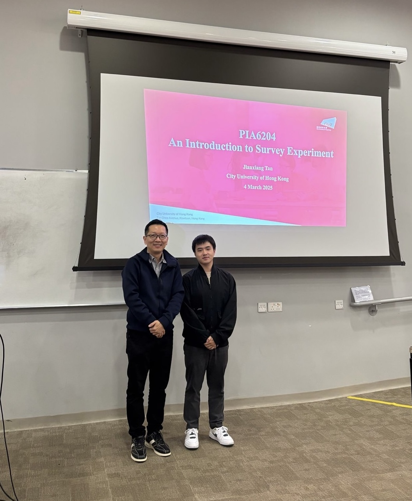

  <strong>Jan 2025 - Jun 2025 Teaching Assistant</strong>

Course: Statistical Analysis for Public Policy and Management (Instructor: Yanto Chandra) 

Main Tasks: (1) Guest lecture: An Introduction to Survey Experiment; (2) Assess students’ assignments

{fig-align="center" width=300px}
